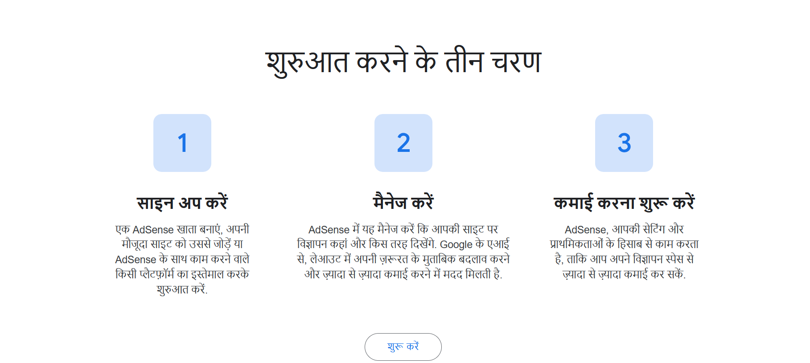

# Google AdSense क्या है? 2026 में Approval कैसे लें और इससे पैसे कैसे कमाएँ

अगर आप अपनी Website या Blog से ऑनलाइन पैसे कमाना चाहते हैं, तो आपने **Google AdSense** का नाम जरूर सुना होगा। दुनिया भर के लाखों Website Owner और Blogger अपनी वेबसाइट पर Google के विज्ञापन दिखाकर हर महीने अच्छी कमाई कर रहे हैं।

लेकिन नए लोगों के मन में कई सवाल होते हैं, जैसे कि Google AdSense क्या है, यह कैसे काम करता है, Approval कैसे मिलता है, कितने Visitor होने चाहिए और इससे पैसे कैसे मिलते हैं।

इस लेख में हम Google AdSense से जुड़ी सभी महत्वपूर्ण जानकारी आसान हिंदी में विस्तार से समझेंगे।

## Google AdSense क्या है?

Google AdSense, Google द्वारा बनाया गया एक Advertising Program है जिसकी मदद से Website Owner अपनी वेबसाइट पर Google के Ads दिखाकर पैसे कमा सकते हैं।

जब आपकी वेबसाइट पर Visitor आते हैं, तब Google उनके Interest और Search History के अनुसार Relevant Ads दिखाता है। अगर कोई Visitor उन Ads पर क्लिक करता है या कुछ प्रकार के Ads केवल देखने पर Revenue Generate करते हैं, तो Google उस Revenue का एक हिस्सा Website Owner को देता है।

यही कारण है कि Google AdSense दुनिया का सबसे लोकप्रिय Website Monetization Program माना जाता है।

---

## Google AdSense कैसे काम करता है?

Google AdSense मुख्य रूप से Advertiser, Google और Publisher इन तीन लोगों के बीच काम करता है।

इसकी प्रक्रिया कुछ इस प्रकार होती है:

1. कोई Company Google Ads के माध्यम से अपना Advertisement चलाती है।
2. Google उस Advertisement को आपके Website Content के अनुसार चुनता है।
3. Visitor आपकी वेबसाइट पर आता है।
4. Google उस Visitor को सबसे Relevant Advertisement दिखाता है।
5. यदि Visitor Ad पर क्लिक करता है या Ad View से Revenue बनता है, तो Google उसका हिस्सा आपको देता है।

इस पूरी प्रक्रिया में Website Owner को किसी Company से सीधे संपर्क करने की आवश्यकता नहीं होती।

---

## Google AdSense से पैसे कैसे मिलते हैं?

AdSense में कमाई कई Factors पर निर्भर करती है।

- Website का Topic
- Visitor किस Country से आ रहे हैं
- CPC (Cost Per Click)
- RPM (Revenue Per 1000 Views)
- Organic Traffic
- User Engagement

उदाहरण के लिए यदि आपकी Website Finance, Insurance, Technology या AI जैसे High CPC Topic पर है, तो प्रति क्लिक अधिक कमाई हो सकती है।

---

## Google AdSense Account कैसे बनाएं?

Google AdSense Account बनाना बिल्कुल मुफ्त है।

इसके लिए आपको निम्नलिखित Steps Follow करने होंगे।

1. Google AdSense Website पर जाएँ।
2. अपनी Gmail ID से Login करें।
3. अपनी Website का URL डालें।
4. Payment Country चुनें।
5. सभी Terms Accept करें।
6. Account Create करें।
7. AdSense Verification Code Website में Add करें।
8. Website Review के लिए Submit करें।

अगर आपकी Website Google की सभी Policies को Follow करती है, तो कुछ दिनों में Approval मिल सकता है।

---

## Google AdSense Approval के लिए आवश्यक शर्तें

Google हर Website को Approval नहीं देता।

Approval मिलने के लिए आपकी Website में निम्न बातें होनी चाहिए।

### Original Content

Website पर लिखा गया Content पूरी तरह Original होना चाहिए। Copy-Paste या AI Generated Low Quality Content से Approval मिलने की संभावना कम हो जाती है।

### Mobile Friendly Website

आज अधिकांश लोग Mobile से Internet का उपयोग करते हैं। इसलिए आपकी Website सभी Devices पर सही तरीके से खुलनी चाहिए।

### Fast Loading Speed

धीमी Website Visitor Experience खराब करती है। इसलिए Website की Speed अच्छी होनी चाहिए।

### Important Pages

Website पर कम से कम ये Pages जरूर होने चाहिए।

- About Us
- Contact Us
- Privacy Policy
- Disclaimer
- Terms and Conditions

### SSL Certificate

Website HTTPS पर चलनी चाहिए।

### Easy Navigation

Visitor आसानी से किसी भी Page तक पहुँच सके।

---

## Google AdSense Approval जल्दी कैसे प्राप्त करें?

यदि आप जल्दी Approval चाहते हैं, तो इन बातों का ध्यान रखें।

- कम से कम 20 से 30 अच्छी Quality वाले Article Publish करें।
- प्रत्येक Article कम से कम 1200 से 2000 शब्दों का रखें।
- Internal Linking करें।
- सभी Images Compress करें।
- Spam Backlinks से बचें।
- Website का Design Professional रखें।
- Broken Links Fix करें।
- नियमित रूप से नया Content Publish करें।

---

## Google AdSense Approval Reject क्यों हो जाता है?

कई बार Website अच्छी होने के बाद भी Approval नहीं मिलता।

इसके मुख्य कारण हैं।

- Thin Content
- Copy Content
- AI Spam Content
- बहुत कम Article
- Poor User Experience
- Navigation Problem
- Missing Privacy Policy
- Copyright Images
- Invalid Traffic

यदि Reject हो जाए तो पहले समस्या को ठीक करें और उसके बाद दोबारा Apply करें।

---

## Google AdSense से कितनी कमाई हो सकती है?

इस सवाल का कोई निश्चित उत्तर नहीं है।

कमाई इन चीजों पर निर्भर करती है।

- Traffic
- Country
- CPC
- Website Topic
- Visitor Engagement

यदि आपकी Website पर प्रतिदिन हजारों Organic Visitor आते हैं और Content Quality अच्छी है, तो AdSense अच्छी कमाई का स्रोत बन सकता है।

---

## Google AdSense के फायदे

- Google का Official Program है।
- Account बनाना Free है।
- Automatic Ads दिखते हैं।
- Worldwide Payment Support।
- Website Monetization का सबसे आसान तरीका।
- सुरक्षित और विश्वसनीय।

---

## Google AdSense के नुकसान

- Approval तुरंत नहीं मिलता।
- Google Policies का पालन करना पड़ता है।
- Invalid Click होने पर Account Suspend हो सकता है।
- शुरुआत में कम Traffic होने पर कम कमाई होती है।

---

## क्या नई Website पर AdSense मिल सकता है?

हाँ, यदि आपकी Website पर Original Content, अच्छा User Experience और सभी आवश्यक Pages मौजूद हैं, तो नई Website को भी AdSense Approval मिल सकता है।

Google Website की उम्र से ज्यादा उसकी Quality को महत्व देता है।

---

## Google AdSense के लिए Best Practices

यदि आप लंबे समय तक AdSense से कमाई करना चाहते हैं, तो इन बातों का हमेशा ध्यान रखें।

- केवल Original Content लिखें।
- Helpful और Detailed Article Publish करें।
- User Experience बेहतर रखें।
- Website की Speed Optimize करें।
- SEO पर काम करें।
- Organic Traffic बढ़ाएँ।
- Ads की संख्या जरूरत से ज्यादा न रखें।
- Google Policies का पालन करें।

## निष्कर्ष

